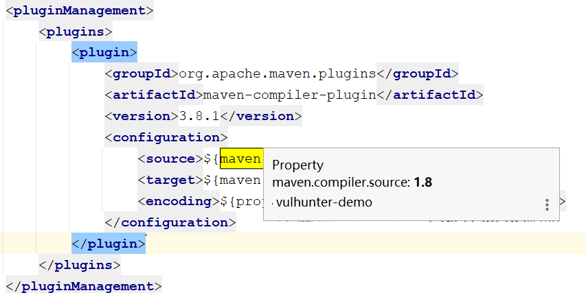

#### 1.兼容低版本tomcat6及jetty6，将servlet-api由3.0降到2.5
H2为支持jdk6+tomcat6，在vulhunter-demo pom.xml中修改h2版本
```xml
<dependency>
    <groupId>com.h2database</groupId>
    <artifactId>h2</artifactId>
    <!--<version>1.4.200</version>-->
    <version>1.3.171</version>
</dependency>
```

#### 2.tomcat转jetty,需要注释spring-demo中的defaultServlet，该servlet是基于tomcat容器的
jetty实现相同的功能是在jetty/etc/webdefault.xml,修改以下属性即可
```xml
<init-param>
    <param-name>dirAllowed</param-name>
    <param-value>true</param-value>
</init-param>
```
#### 3.jetty8需要关闭web.xml中一下配置
  ```xml 
  <!-- 验证方式 -->
  <login-config>
    <auth-method>BASIC</auth-method> <!-- BASIC方式验证-->
    <!--<auth-method>DIGEST</auth-method>--> <!-- DIGEST方式验证 -->
    <realm-name>Authenticate</realm-name> <!-- 验证时标题 -->
  </login-config>
```

#### 4.jboss6+jdk6
项目lib与jboss存在jar包冲突，故删除了本项目中的xalan-2.7.2.xml, xml-apis-1.4.01.jar,xercesImpl-2.11.0.jar,jaxb-api-2.3.1.jar。<br/>
vulhunter-common添加jaxb-api版本(https://stackoverflow.com/questions/35206215/java-lang-classcastexception-org-apache-xerces-jaxp-saxparserfactoryimpl-cannot)
```xml
<dependency>
<groupId>javax.xml.bind</groupId>
<artifactId>jaxb-api</artifactId>
<version>2.3.0</version>
<scope>compile</scope>
</dependency>
```
spring-demo jira排除jaxb-api依赖
```xml
<dependency>
      <groupId>com.atlassian.jira</groupId>
      <artifactId>jira-rest-java-client</artifactId>
      <version>1.2-m01</version>
    </exclusions>
        ...
        <exclusion>
            <artifactId>jaxb-impl</artifactId>
            <groupId>com.sun.xml.bind</groupId>
        </exclusion>
    </exclusions>
</dependency>
```
jdk6相关设置<br/>
jdk6版本只支持okhttp2.0以下的版本，为适配jdk1.6此方法要重写，本类中方法先关闭待后续重写<br/>
1.spring-demo及vulhunter-common中 jaxb-api、jaxb-impl、jaxb-core从2.3.0改为2.2.11<br/>
2.spring-demo中okhttp由2.7.5改为1.6.0，相关httpclient方法需要重写<br/>
3.spring-demo启动失败可能跟play-iteratees相关jar相关，如图<br/>
4.windows的maven版本改为3.1.1<br/>
5.maven-compiler-plugin 由3.8.1改为2.3.2或2.5.1<br/>

### jboss7+jdk6
1.关闭jsf-impl和jsf-api的依赖<br/>
2.删除vulhunter-common中hibernate的配置文件persistent.xml配置，demo中为用到hibernate框架<br/>


#### 5.为了适配jdk11，将servlet和maven-compiler-plugin的java版本做了升级
<br/>
经测试jetty8+jdk11 jsp编译报错，接口可以正常访问，应该跟容器相关jar有关，作为参考tomcat8+jdk11是可以运行的